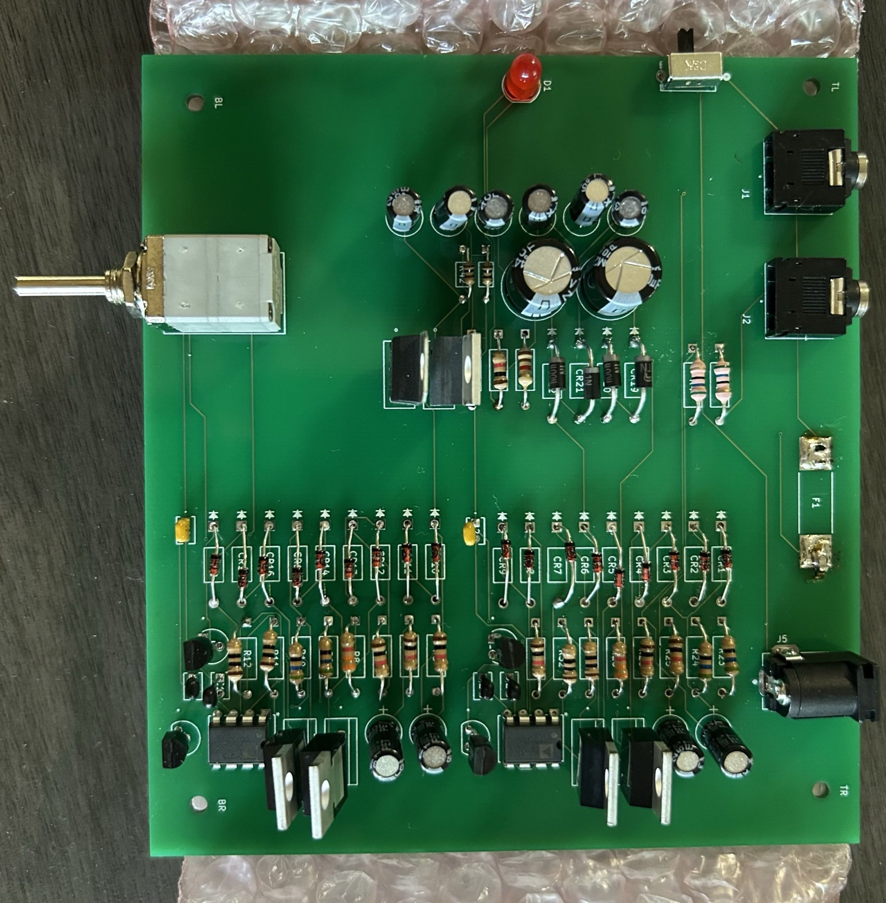
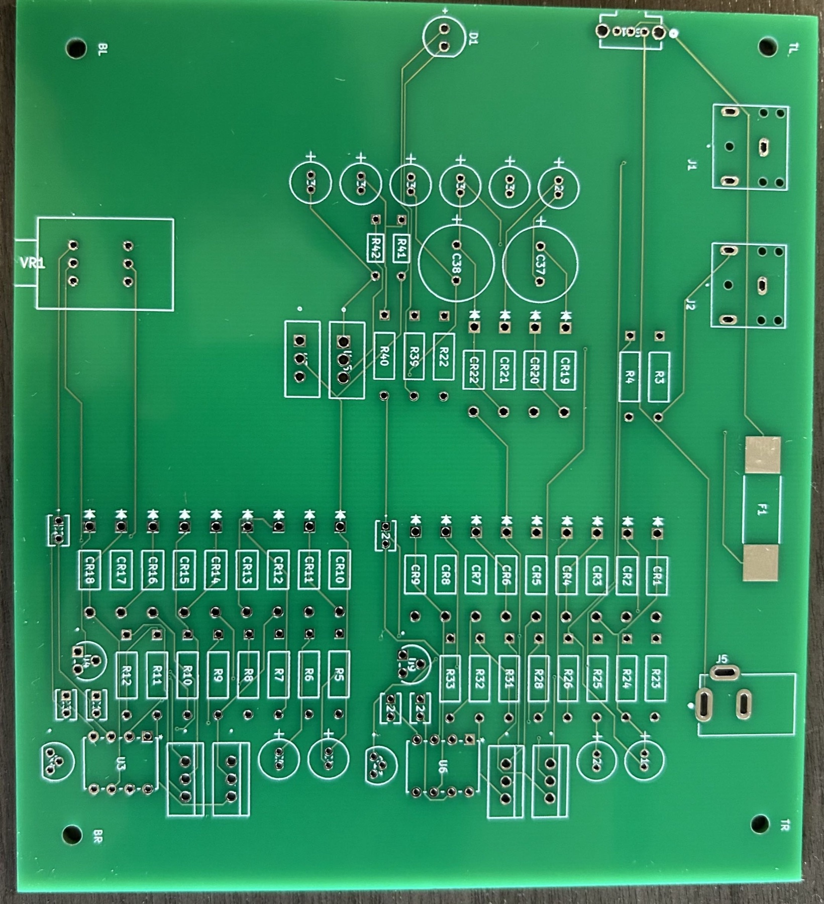
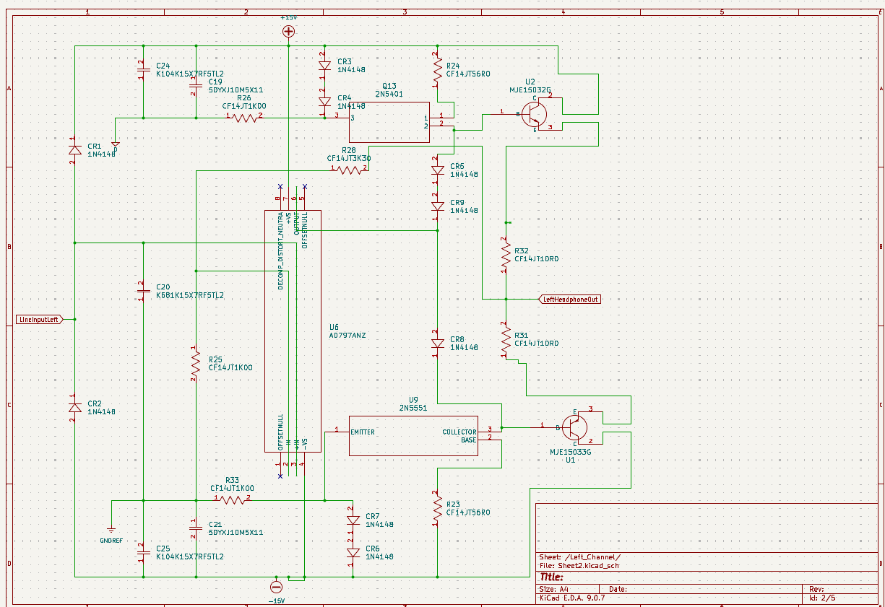
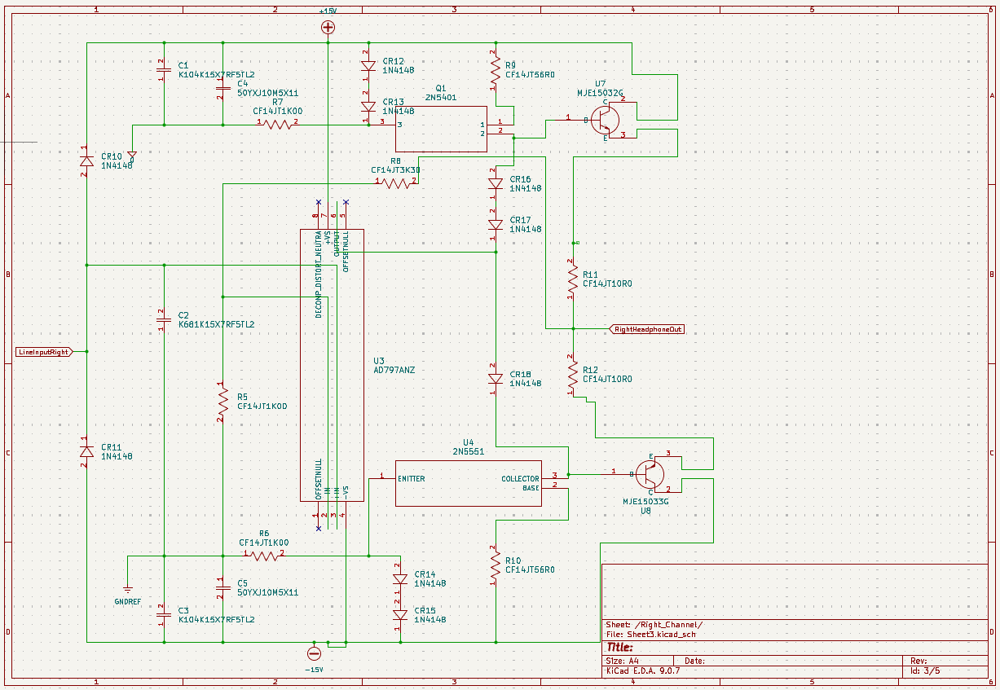
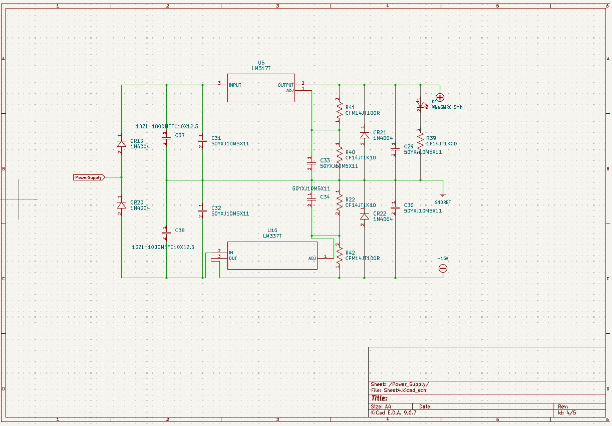
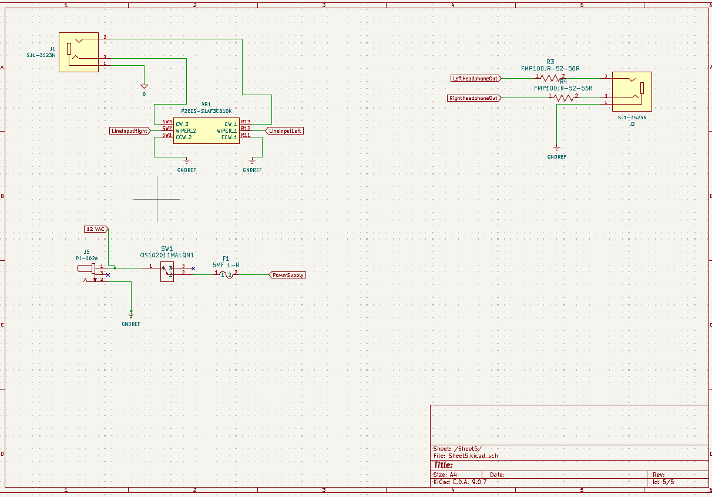

# Stereo Audio Amplifier PCB

A custom two-channel audio amplifier and headphone-output PCB designed in KiCad. The design combines a dual-channel analog signal path, complementary transistor output stages, adjustable split-rail power regulation, and board-level audio and power connections.

## Fabricated hardware

The design was taken from schematic and layout through PCB fabrication and through-hole assembly.

| Fabricated PCB | Assembled board |
| --- | --- |
|  |  |

## Design overview

- Independent left and right amplifier channels
- AD797 precision operational amplifiers
- Complementary NPN/PNP transistor output stages
- LM317/LM337 adjustable positive and negative regulation
- Split `+15 V` / `-15 V` supply rails
- Stereo line input, volume control, headphone output, power switch, and fuse
- Two-layer through-hole PCB layout with four mounting points
- Fabricated and hand-assembled physical prototype

## Schematics

| Left channel | Right channel |
| --- | --- |
|  |  |

| Power supply | I/O and power connections |
| --- | --- |
|  |  |

## Repository contents

- `gerbers/` — fabrication layers, drill files, and the Gerber job file
- `docs/` — fabrication photos, assembly photo, schematic captures, and PCB-layout image

## Tools

- KiCad 9
- Gerber fabrication outputs

## Author

[Tarun Ambati](https://github.com/vypearr)
